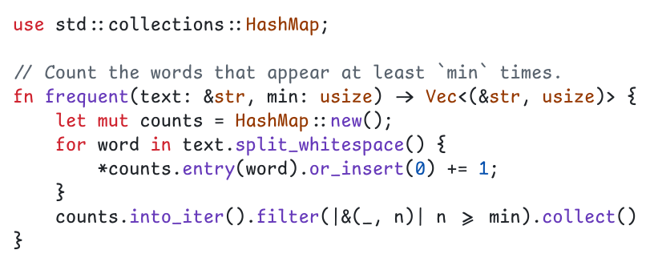
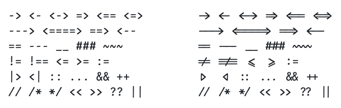
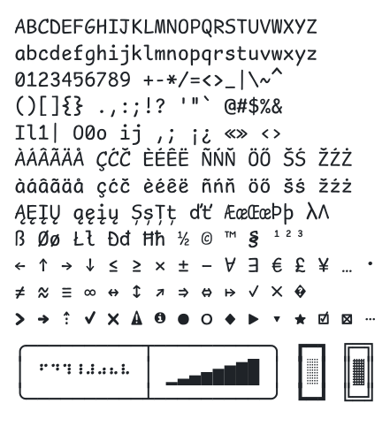

# Comic Caret

A hand-drawn monospaced font for code and terminals, in the spirit of Comic Sans, and made to
stay readable through a long day of work.



**[Download the latest release](https://github.com/sunshine-syz/comic-caret/releases/latest)** ·
[Changelog](CHANGELOG.md) · [Report a problem](https://github.com/sunshine-syz/comic-caret/issues)

## Why Comic Caret

- **Friendly, on a strict grid.** Round stroke ends and a slight wobble, but every character is
  the same width and lines are 1.25 em apart, so columns and boxes line up.
- **Look-alikes look different.** `l` ends in a tail, `0` has a slash, the dots of `i` and `j`
  sit high, `:` and `;` are full size, and `( )` `[ ]` `{ }` each have their own shape. These
  choices follow Intel One Mono, which was designed with low-vision developers.
- **Ligatures that keep the grid.** `->` `=>` `!=` `>=` and more join into one symbol, but
  every character keeps its own cell, so the cursor still moves one character at a time.
- **Ready for terminals.** Every box-drawing and block character and all 256 Braille patterns,
  for borders, trees, tables, progress bars, spinners and graphs, plus a
  [Nerd Font edition](#nerd-font-edition) with icons.

## Install

1. Download `ComicCaret-<version>.zip` from the
   [latest release](https://github.com/sunshine-syz/comic-caret/releases/latest). For icons,
   take `ComicCaretNerdFont-<version>.zip` instead.
2. Install one of the two font files; they hold the same font. On Windows take the TTF, which
   carries rendering settings for ClearType; on macOS and Linux either works.
   - macOS: double-click the file, then click **Install**.
   - Windows: right-click the file, then choose **Install**.
   - Linux: copy the file to `~/.local/share/fonts/`, then run `fc-cache -f`.
3. Choose **Comic Caret** in your editor or terminal, for example
   `"editor.fontFamily": "Comic Caret"` in VS Code.

## Ligatures

Comic Caret joins common coding sequences into one symbol. Every character still takes its
own cell, so columns line up and the cursor moves one character at a time.



- Arrows of any length: `->` `<-` `<->` `=>` `<==` `<=>` `--->` `<====>`
- Continuous lines of any length: `==` `--` `__` `##` `~~`
- `!=` `!==` as ≠ ≢, `<=` `>=` as ⩽ ⩾, and `:=` with the colon centered on the `=`
- `|>` `<|` as triangles
- Pairs pulled together: `::` `...` `&&` `++` `//` `/*` `*/` `<<` `>>` `??` `||`

Sequences that run into other operators stay as separate characters, for example `->>`,
`<<-`, `==<`, `<<=` or `https://`.

The ligatures use the `calt` (contextual alternates) OpenType feature:

| App | On | Off |
|---|---|---|
| VS Code | `"editor.fontLigatures": true` | `false` (the default) |
| JetBrains IDEs | Settings → Editor → Font → Enable ligatures | Clear it (the default) |
| iTerm2 | Settings → Profiles → Text → Use ligatures | Clear it (the default) |
| kitty | On by default | `disable_ligatures always` |
| WezTerm | On by default | `harfbuzz_features = { 'calt=0' }` |
| Ghostty | On by default | `font-feature = -calt` |
| Windows Terminal | On by default | `"font": { "features": { "calt": 0 } }` in the profile |

## Nerd Font edition

`ComicCaretNerdFont-<version>.zip` adds the [Nerd Fonts](https://www.nerdfonts.com/) icons
(Powerline symbols, file-type, Git and OS icons). It holds two families; install the OTF or
the TTF of the one you want:

| Family | Icons |
|---|---|
| ComicCaret Nerd Font | Full size; wide icons overhang into the next cell |
| ComicCaret Nerd Font Mono | Shrunk to fit one cell, for terminals that clip wider glyphs |

Both install alongside plain Comic Caret and keep its ligatures. The icons come from the icon
sets Nerd Fonts collects and keep their own licenses, such as CC BY 4.0, Apache 2.0 and OFL
1.1; `ICON-LICENSES.txt` in the zip lists them.

## Character set



ASCII, the Latin letters and signs of Western, Central European, Baltic and Turkish text, λ Λ,
straight, diagonal and double arrows, common math signs such as ≠ ≈ ≡ ∞, the check marks ✓ ✗
and �, all of Box Drawing and Block Elements, and Braille. Not there yet: Cyrillic and most
of Greek.

## Building from source

You need [FontForge](https://fontforge.org/) (`brew install fontforge` on macOS). The Nerd Fonts
builds also need `curl` and `unzip`, and the tests need HarfBuzz (`hb-shape`, `hb-view`).

```sh
./build.sh                          # fonts/ComicCaret-Regular.otf and .ttf
./build.sh --nerd                   # also ComicCaret Nerd Font in build/nerd/
./build.sh --nerd=default,mono      # ... and ComicCaret Nerd Font Mono
./build.sh --release                # both release zips in dist/, from a clean checkout
python3 -m unittest discover tests  # after building
```

The source is `src/ComicCaret-Regular.sfd`; edit it in FontForge. The ligatures are generated:
don't edit their glyphs (`LIG`, `*.sta`, `*.liga` and the like) by hand. Change
`src/ligatures.fea` or `tools/add_ligatures.py` instead, then run
`python3 tools/add_ligatures.py` and `./build.sh`. [CLAUDE.md](CLAUDE.md) lists the rules the
source follows and the checks to run after changing it.

## Credits

Comic Caret is based on [Comic Shanns Mono](https://github.com/jesusmgg/comic-shanns-mono) by
Jesús González, with contributions from Rodrigo Batista de Moraes, Fini Jastrow, Kyle Beechly
and others. Comic Shanns Mono is a monospaced version of Shannon Miwa's
[Comic Shanns](https://github.com/shannpersand/comic-shanns).

Glyph sizes and positions were measured against
[Fira Code](https://github.com/tonsky/FiraCode),
[Maple Mono](https://github.com/subframe7536/maple-font) and
[Intel One Mono](https://github.com/intel/intel-one-mono); no outlines were copied from them.

## License

MIT; see [LICENSE.md](LICENSE.md). The icons in the [Nerd Font edition](#nerd-font-edition)
keep their own licenses.
