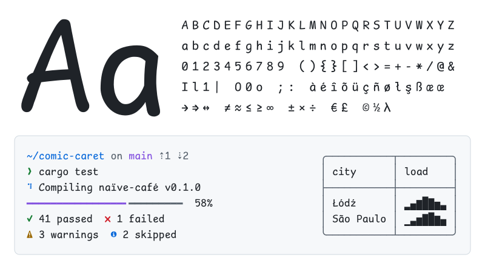
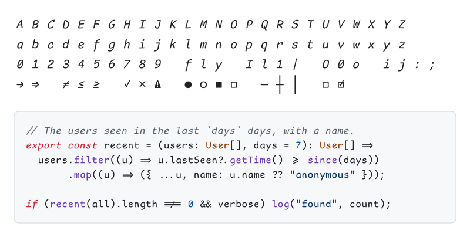
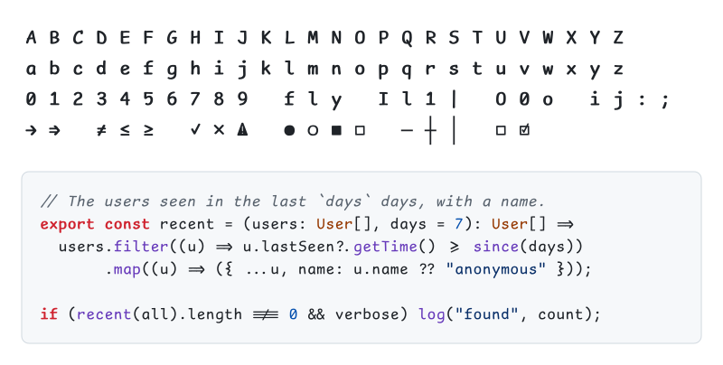
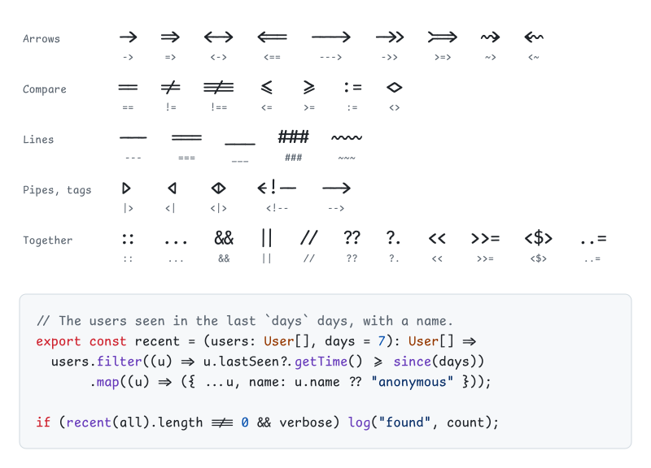

<p align="center">
  
</p>

<p align="center">
  A casual monospaced font for code and terminals, in the spirit of Comic Sans,<br>
  and made to stay readable through a long day of work.
</p>

<p align="center">
  <b><a href="https://github.com/sunshine-syz/comic-caret/releases/latest">Download the latest release</a></b> ·
  <a href="CHANGELOG.md">Changelog</a> ·
  <a href="https://github.com/sunshine-syz/comic-caret/issues">Report a problem</a>
</p>

<p align="center">
  
</p>

## Why Comic Caret

- **Friendly, on a strict grid.** Round stroke ends and a slight wobble, but every character is
  the same width and lines are 1.25 em apart, so columns and boxes line up.
- **Look-alikes look different.** `l` ends in a tail, `0` has a slash, the dots of `i` and `j`
  sit high, `:` and `;` are full size, and `( )` `[ ]` `{ }` each have their own shape. These
  choices follow Intel One Mono, which was designed with low-vision developers.
- **Ligatures that keep the grid.** `->` `=>` `!=` `>=` and more join into one symbol, but
  every character keeps its own cell, so the cursor still moves one character at a time.
- **Ready for terminals.** Every box-drawing and block character, all 256 Braille patterns and
  the Powerline symbols, for borders, trees, tables, progress bars, spinners, graphs and
  prompts, plus a [Nerd Font edition](#nerd-font-edition) with icons.
- **An italic of its own.** Comic Caret Italic slants the text and gives `f` a descender, and
  keeps the borders, shapes and status marks upright, so editors that italicize comments and
  keywords no longer slant the regular themselves.
- **A bold of its own.** Comic Caret Bold draws the text with a heavier pen, as dark as the
  bolds of other coding fonts. Its `n`, `o` and `e` stay at least as open as in the tightest
  of them. The borders, shapes and spinners keep the regular's weight. Editors that set
  keywords in bold, and terminals that print bold text, no longer thicken the regular
  themselves.

<p align="center">
  
</p>

## Install

1. Download `ComicCaret-<version>.zip` from the
   [latest release](https://github.com/sunshine-syz/comic-caret/releases/latest). For icons,
   take `ComicCaretNerdFont-<version>.zip` instead.
2. Install the Regular, Italic and Bold files of one format; the OTF and TTF hold the same
   fonts. On Windows take the TTFs, which carry rendering settings for ClearType; on macOS and
   Linux either works.
   - macOS: double-click the file, then click **Install**.
   - Windows: right-click the file, then choose **Install**.
   - Linux: copy the file to `~/.local/share/fonts/`, then run `fc-cache -f`.
3. Choose **Comic Caret** in your editor or terminal, for example
   `"editor.fontFamily": "Comic Caret"` in VS Code.

**Coming from Comic Shanns Mono?** Comic Caret has its own family name, so the two can stay
installed side by side; choose Comic Caret in your settings. The
[1.0.0 notes](CHANGELOG.md#100-2026-09) list everything that changed.

**Coming from 1.x?** In Comic Caret 2.0 each character is 600 units wide, 0.6 em, 9% wider
than 1.x's 550, so lowering the font size by about one point keeps a terminal's column count.

## Italic

Comic Caret Italic is the regular slanted 12°, with `f` given a descender. Every character
keeps its cell, the ligatures still join, and what is drawn as a picture stays upright: box
drawing, block elements, Braille, the Powerline symbols, the shapes and spinner frames, the
status marks and the key hints. Editors and terminals pick it up as the family's italic.

<p align="center">
  
</p>

## Bold

Comic Caret Bold is the regular drawn with a heavier pen: stems grow 35 units and level
strokes 14. Every character keeps its cell, `-` stays on the line of `=` and the arrows, and
the ligatures still join. What is drawn as a picture keeps the regular's weight: box drawing,
block elements, the shapes, Braille, the Powerline symbols, the spinner frames, ⏵ ⏸ ⏺ and
☐ ☑ ☒, so borders, tables and progress bars look the same in both weights. Editors and
terminals pick it up as the family's bold.

<p align="center">
  
</p>

## Ligatures

Comic Caret joins common coding sequences into one symbol. Every character still takes its
own cell, so columns line up and the cursor moves one character at a time.

<p align="center">
  
</p>

- Arrows of any length: `->` `<-` `<->` `=>` `<==` `<==>` `--->` `<====>`, with two heads
  (`->>` `<<-`) or a wave (`~>` `<~` `~~>`), and `>=>` `<=<` with a tail
- Continuous lines: `==` `##` `~~` of any length, and `---` `___` from three characters on
- `!=` `!==` as ≠ ≢, `<=` `>=` as ⩽ ⩾, and `:=` with the colon centered on the `=`
- `|>` `<|` `<|>` as triangles, `<>` as a diamond, and `<!--` with an arrowhead like `-->`'s
- Pulled together: `::` `..` `...` `&&` `++` `//` `/*` `*/` `<<` `>>` `??` `||` `?.` `?:`, and
  `<<<` `>>>` `|||` `&&&` `>>=` `<<=` `=<<` `<$>` `<*>` `<=>` `..=` `..<`

Sequences that run into other operators stay as separate characters, for example `->>>`,
`<<<-`, `==<`, `<<==` or `https://`. So do two `-` or `_`, as in `--help`, `i--` and
`__init__`; `~>` before a version, as in `~> 1.0`; `..` in a path or a Python import, as in
`../`, `cd ..` and `from .. import`; and pairs beside a name where they are no operator, as in
`src/*`, `*/5` and `Vec<Vec<u8>>`. A shell heredoc's `<<-EOF`, `<<-'EOF'`,
`<<-"EOF"` and `<<-\EOF` stay plain too; with a space, `<<- EOF` draws the two-headed arrow,
since that is how R writes `x <<- y`.

The ligatures use the `calt` (contextual alternates) OpenType feature:

| App | On | Off |
|---|---|---|
| VS Code | `"editor.fontLigatures": true` | `false` (the default) |
| JetBrains IDEs | Settings → Editor → Font → Enable ligatures | Clear it (the default) |
| iTerm2 | Settings → Profiles → Text → Use ligatures | Clear it (the default) |
| kitty | On by default | `disable_ligatures always` |
| WezTerm | On by default | `harfbuzz_features = { 'calt=0' }` |
| Ghostty | On by default | `font-feature = -calt` |
| Windows Terminal | On by default | `"font": { "features": { "calt": 0 } }` in the profile |

## Nerd Font edition

`ComicCaretNerdFont-<version>.zip` adds the [Nerd Fonts](https://www.nerdfonts.com/) icons
(file-type, Git and OS icons, and the extra Powerline separators) in the family ComicCaret Nerd
Font, in Regular, Italic and Bold. Full-size wide icons overhang into the next cell. Install
the OTF or the TTF; it sits alongside plain Comic Caret and keeps its ligatures. The icons come
from the icon sets Nerd Fonts collects and keep their own licenses, such as CC BY 4.0, Apache
2.0 and OFL 1.1; `ICON-LICENSES.txt` in the zip lists them.

For icons shrunk to fit one cell, build ComicCaret Nerd Font Mono from source with
`./build.sh --nerd=mono`.

## Character set

| Block | Coverage |
|---|---|
| **Latin** | Complete: Basic Latin (ASCII), Latin-1 Supplement, Latin Extended-A (all but the deprecated ʼn) and Google Fonts' Latin Core, so Western, Central European, Baltic and Turkish text, with ẞ, the combining accents that decomposed text such as macOS file names needs, and the spaces copied text carries: the thin and narrow no-break spaces take a cell, and the zero-width space, joiners, word joiner and byte order mark take none. |
| **Greek** | Complete: Google Fonts' Greek Core, for modern Greek text and the letters math and code use as names (θ Δt λ). |
| **Box Drawing, Block Elements, Braille** | Complete, for borders, trees, tables, progress bars, spinners and graphs. |
| **Powerline** | The basic symbols (U+E0A0–E0A2, U+E0B0–E0B3): the branch, line number and padlock, and the solid and thin separators, which fill the cell so a prompt's colored segments meet without a seam. Powerlevel10k, Starship, vim-airline and tmux themes use these; the [Nerd Font edition](#nerd-font-edition) adds the extra separators. |
| **Symbols** | In part: the arrows, math signs and currency code tends to use (← ⇒ ↕ ≠ ≈ ≡ ≤ ∞ ∑ ∫ √ ∂ ∇ ⟨ ⟩ € £ ₹ ₽), superscript and subscript figures and signs (m² 10⁻³ CO₂), the check marks ✓ ✗ and �, the prompt and status symbols of shells and CLI tools (❯ ➜ ⇡ ✔ ✖ ⚠ ● ▶ ☐), those of terminal UIs such as Claude Code, Rich and Vitest (⏺︎ ⎿ ✻ ⏸︎ ❱ ⎯), the spinner frames of cli-spinners, which Rich, ora and Ink animate (◐ ◜ ◰ ◢ ☰ ✷ ⊶ ☖ ▰), the fractions and letterlike symbols (⅓ ⅞ № ℓ ℃), key hints (⌘ ⌥ ⌃ ⇧ ⇪ ⏎) and editors' visible whitespace (␣ ↵ ⇥). |

## Building from source

You need [FontForge](https://fontforge.org/) (`brew install fontforge` on macOS). The Nerd Fonts
builds also need `curl`, `unzip` and `shasum`, and the tests need HarfBuzz (`hb-shape`,
`hb-view`) and `git`. `tools/proof_sheet.py` also needs `hb-info`, and `./build.sh --release`
needs `zip`. The Font Bakery and ots (OpenType Sanitizer) tests run those tools through
[`uv`](https://docs.astral.sh/uv/)'s `uvx`, which fetches them the first time, and skip
without `uvx`.

```sh
./build.sh                          # fonts/ComicCaret-{Regular,Italic,Bold}.otf and .ttf
./build.sh --nerd                   # also ComicCaret Nerd Font in build/nerd/
./build.sh --nerd=default,mono      # ... and a local ComicCaret Nerd Font Mono
./build.sh --release                # both release zips in dist/, from a clean checkout
python3 -m unittest discover tests  # after building
```

The source is `src/ComicCaret-Regular.sfd`; edit it in FontForge. The ligatures, combining
marks, box drawing, Powerline symbols and spinner frames are generated by the scripts in
`tools/`, so change them there and rerun the script rather than editing their glyphs. The
italic, `src/ComicCaret-Italic.sfd`, and the bold, `src/ComicCaret-Bold.sfd`, are generated
from the regular by `tools/make_italic.py` and `tools/make_bold.py`.
[CLAUDE.md](CLAUDE.md) lists the rules the source follows and the checks to run after changing
it.

## Credits

Comic Caret is based on [Comic Shanns Mono](https://github.com/jesusmgg/comic-shanns-mono) by
Jesús González, with contributions from Rodrigo Batista de Moraes, Fini Jastrow, Kyle Beechly
and others. Comic Shanns Mono is a monospaced version of Shannon Miwa's
[Comic Shanns](https://github.com/shannpersand/comic-shanns).

Glyph sizes and positions were measured against
[Fira Code](https://github.com/tonsky/FiraCode),
[Maple Mono](https://github.com/subframe7536/maple-font) and
[Intel One Mono](https://github.com/intel/intel-one-mono); no outlines were copied from them.

## License

MIT; see [LICENSE.md](LICENSE.md). The icons in the [Nerd Font edition](#nerd-font-edition)
keep their own licenses.
